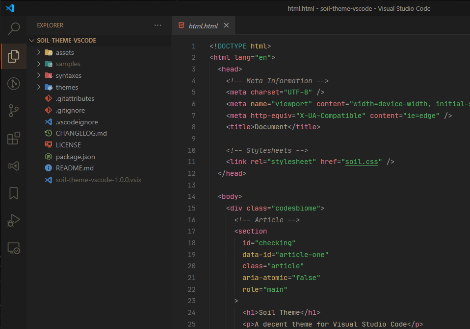
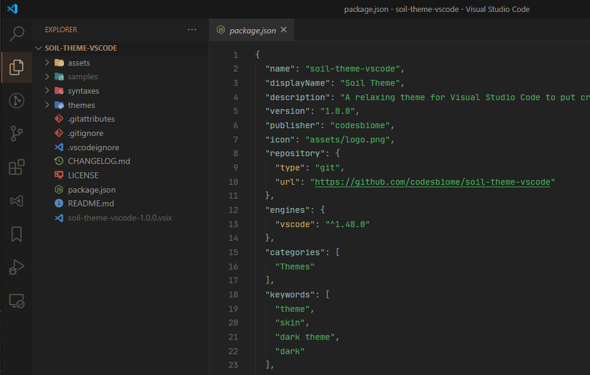

# Soil Theme

> A relaxing dark theme for `Visual Studio Code` with simple colors for the Editor Interface.
> This theme provides easy to read interface for dim-light environments (night).

<br />



<br />

<details>
  <summary>Screenshot 2</summary>
  <br />
  
</details>

<br />

### Supported Languages 🎉

- `HTML`
- `CSS`
- `JavaScript`
- `TypeScript`
- `JSX (React)`
- `XML (XAML/YAML)`
- `Markdown`
- `JSON`
- `YAML`
- `PHP`
- `More upcoming....`

<br>

### Information & Tips 📌

If you're using Windows 10, these settings of `Editor` might provide you a better experience with this theme :

```json
    "editor.fontSize": 13,
    "editor.lineHeight": 22,
    "editor.suggestFontSize": 13,
    "editor.padding.top": 10,
    "terminal.integrated.lineHeight": 1.4,
    "editor.fontFamily": "'Jetbrains Mono', 'Fira Code', Consolas, 'Courier New', monospace",
```

- Text Font : `Jetbrains Mono`
- File Icon Theme : `Material Icon Theme`

<br />

### Issue or Requests

Found any 🐛 bug/glitch or have a request related to this project? Feel free to submit `Issue` at respository <a href="https://github.com/codesbiome/soil-theme-vscode/issues">here</a>.
Cheers 🍻
